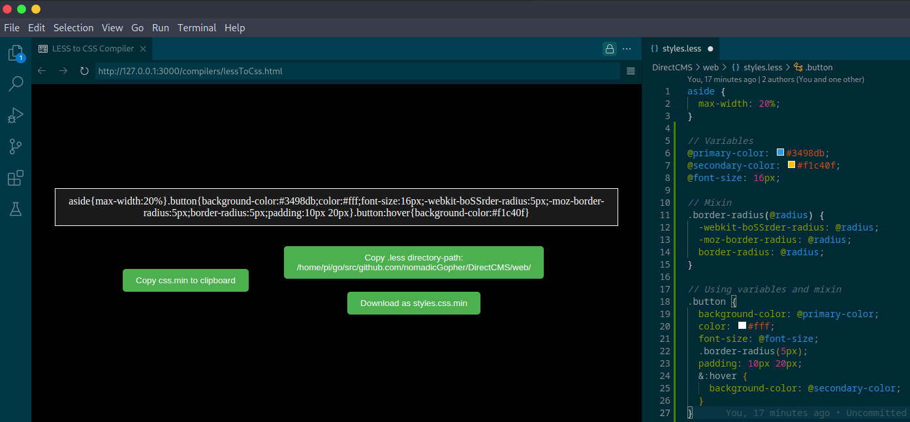

  

## Instrucions with VS Code
* Clone this repo or download the index.html file
* Install and activate the live preview extension by Microsoft
* Add .less code in styles.less (in the same directory as index.html & save
* Right click on the index.html file and select live preview

## Instructions without VS Code
* Clone this repo or download the index.html file
* Add .less code in styles.less (in the same directory as index.html & save
* Start an HTTP server from the current directory. You can simply use `python -m http.server`
* Open `localhost:8080` in a web browser
